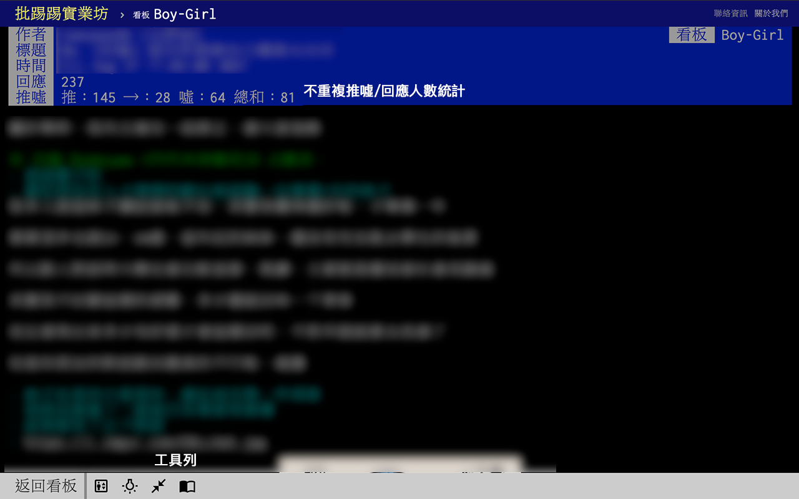
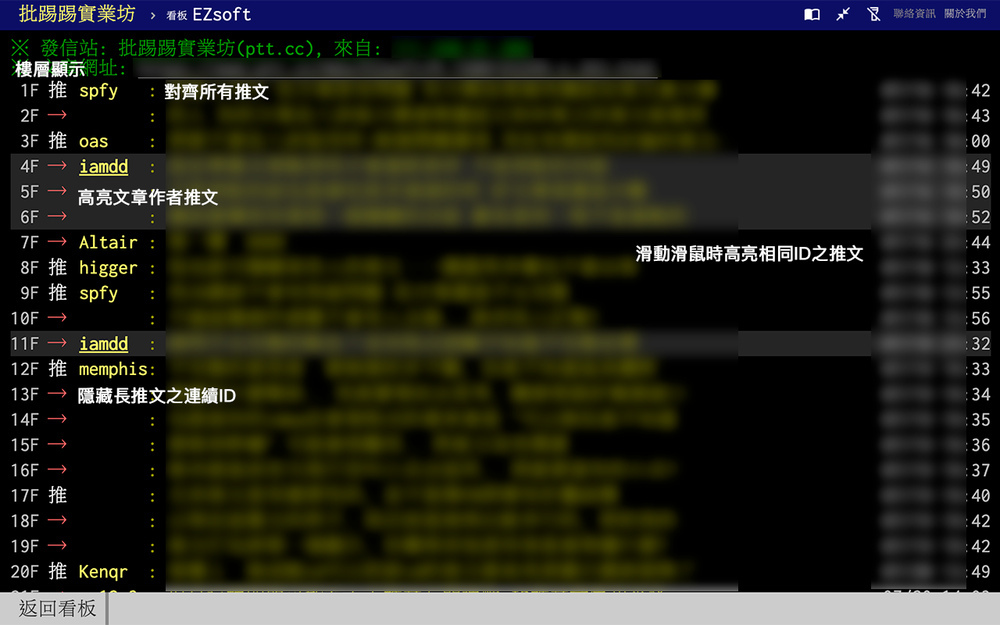
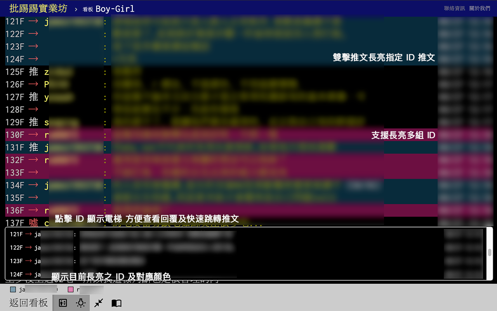
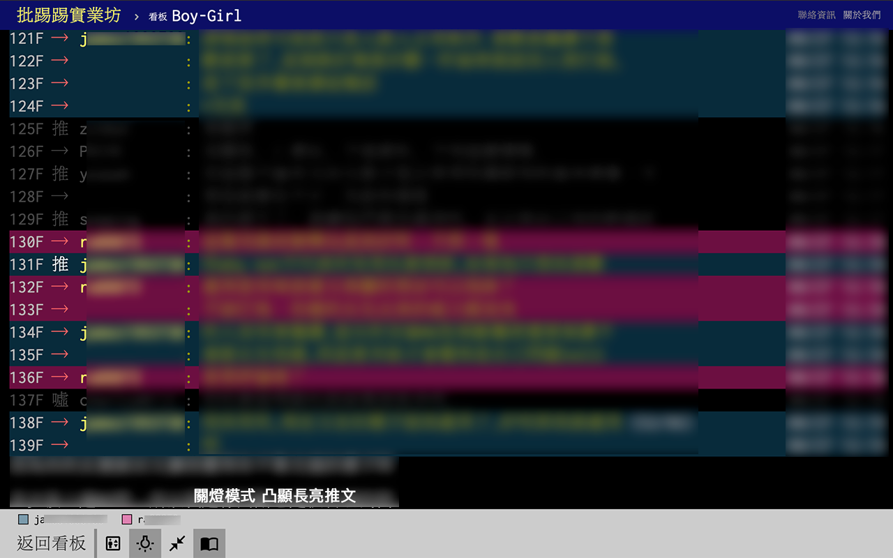
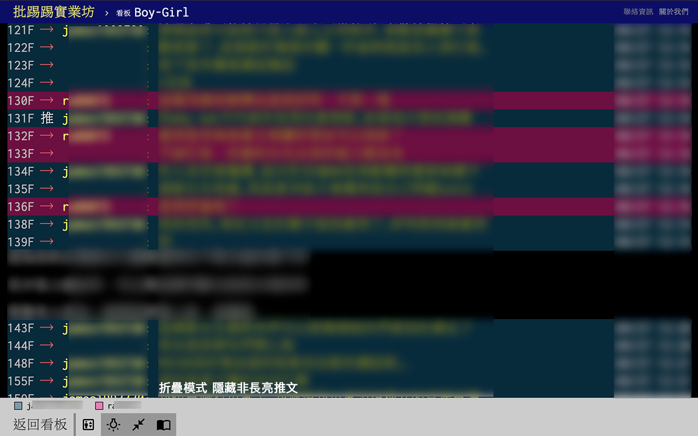

# PTT Web Helper

<a href="https://chrome.google.com/webstore/detail/ptt-web-helper/onchhmicnjipnjocalcjpgbmagggnndm?hl=zh-TW" target="_blank"></a>

增強 https://www.ptt.cc/bbs/ 的網頁功能，讓回文更容易被閱讀。

## 主要功能

* 顯示樓層
  * 電梯模式（快速查閱、跳轉相同 ID 推文）
* 對齊推文 ID
* 顯示滑鼠指向的 ID 的推文統計（方便決定是否進行長亮）
* 隱藏連續推文 ID
* 推文高亮作者 ID
* 不重複推噓文、回覆人數統計
* 快速複製（點擊一則推文後按 y 複製相鄰的同作者推文）
* 滑鼠指向推文時高亮顯示相同 ID 推文
* 雙擊推文時長亮顯示相同 ID 推文
  * 支援將非長亮推文變暗
  * 支援折疊非長亮推文

## 快捷鍵

* 控制列按鈕順序對應到鍵盤的 Q W E R。
* 選定一則推文後，點擊 Y 快速複製相鄰的同作者推文

## 螢幕截圖











## 開發

```
git clone https://github.com/kaiiiz/ptt-web-helper
yarn install
```

```
yarn watch // development
or
yarn build // production
```

## 致謝

* [Google Fonts](https://fonts.google.com/icons)
