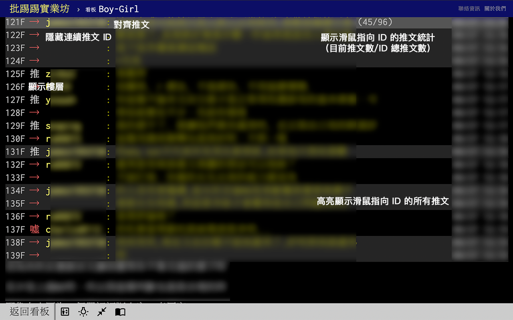

# PTT Web Helper

增強 https://www.ptt.cc/bbs/ 的網頁功能，讓回文更容易被閱讀。

## 主要功能

* 顯示樓層
* 對齊推文 ID
* 隱藏連續推文 ID
* 推文高亮作者 ID
* 不重複推噓文、回覆人數統計
* 滑鼠指向推文時高亮顯示相同 ID 推文
* 雙擊推文時長亮顯示相同 ID 推文
  * 支援將非長亮推文變暗
  * 支援折疊非長亮推文

## 螢幕截圖





## 開發

```
git clone https://github.com/kaiiiz/ptt-web-helper
yarn install
```

```
yarn watch // development
or
yarn build // production
```

## 致謝

* [Google Fonts](https://fonts.google.com/icons)
